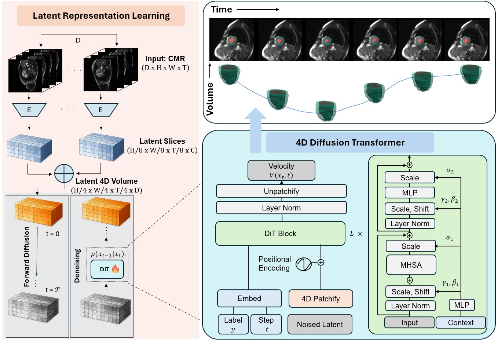

# CardioDiT

Official implementation of CardioDiT, a latent diffusion transformer for
unconditional 4D cardiac cine MRI synthesis.



The repository contains the compact paper-style pipeline:

- Stage 1: a spatiotemporal VQ-GAN trained on individual 2D+t short-axis CMR slices.
- Stage 2: a true 4D Diffusion Transformer over the assembled latent tensor.
- DDPM training with cosine schedule and v-prediction.
- DDPM/DDIM sampling.

Experimental ablations, flow matching, ControlNet, and 3D compatibility code are
intentionally not included in this submission repo.

## Paper

[CardioDiT: Latent Diffusion Transformers for 4D Cardiac MRI Synthesis](https://arxiv.org/pdf/2603.25194)
studies whether cine CMR can be generated by directly modeling the complete
3D+t distribution instead of factorizing space and time. CardioDiT first learns
a spatiotemporal VQ-GAN codebook for 2D+t slices, stacks the resulting latents
into full 4D volumes, and then trains a diffusion transformer with 4D patches
and positional encodings. The paper shows improved through-plane consistency,
temporally coherent cardiac motion, and realistic cardiac function statistics
compared with factorized 2D+t and channel-merged 3D+t baselines.

## Installation

```bash
conda env create -f environment.yml
conda activate cardiodit
```

## Data Format

Training scripts expect CSV files with an `image` column containing absolute
paths to 4D short-axis CMR NIfTI files.

```csv
image
/data/cmr_subject_001.nii.gz
/data/cmr_subject_002.nii.gz
```

The default preprocessing assumes volumes can be reordered to `(H, W, D, T)`.
Use `--dim_perm` in `encode_latents.py` if your files use a different axis order.

## Stage 1: Train VQ-GAN Autoencoder

For the early submission setup, the autoencoder uses 4x compression along all
reconstructed axes: height, width, and time. It is implemented as a 3D VQ-GAN
over single 2D+t short-axis slices. During training, one z-slice is sampled from
each 4D volume and reconstructed as `(1, H, W, T)`. After training, full 4D
volumes are encoded slice-by-slice along depth and stacked into `(C, D, h, w, t)`
latents.

With the current public-data configs:

- Input slice: `(1, 256, 256, 32)`
- Per-slice latent: `(8, 64, 64, 8)`
- Full latent for `D=6`: `(8, 6, 64, 64, 8)`

```bash
torchrun --nproc_per_node=2 src/scripts/train_vqgan.py \
  --config configs/stage1/vqgan.yaml \
  --training_ids ids/train.csv \
  --validation_ids ids/val.csv \
  --output_dir outputs \
  --run_name vqgan
```

## Precompute 4D Latents

```bash
python src/scripts/encode_latents.py \
  --csv ids/train.csv \
  --output_dir data/latents/train \
  --vqvae_ckpt outputs/vqgan/best_model.pth \
  --config configs/stage1/vqgan.yaml \
  --roi_size 256 256 32 \
  --target_frames 32 \
  --target_z 6
```

Repeat for validation data. Each output directory contains a `latents.csv`
with paths to `.pt` tensors of shape `(C, D, H, W, T)`.

Optionally compute the latent scale factor:

```bash
python src/scripts/compute_scale_factor.py \
  --latents_csv data/latents/train/latents.csv \
  --limit 200
```

Set the printed value as `dit.scale_factor` in the compact DiT configs, or as
`training.scale_factor` if using the expanded config schema.

## Stage 2: Train CardioDiT

```bash
torchrun --nproc_per_node=2 src/scripts/train_dit.py \
  --config configs/transformer/dit_ds8_b4.yaml \
  --training_ids data/latents/train/latents.csv \
  --validation_ids data/latents/val/latents.csv \
  --output_dir outputs \
  --run_name dit_b
```

Checkpoints are written to `outputs/<run_name>/`, including
`last_checkpoint.pth` and `best_model.pth`.

## Sampling

```bash
python src/scripts/sample_dit.py \
  --stage1_cfg configs/stage1/vqgan.yaml \
  --stage1_ckpt outputs/vqgan/best_model.pth \
  --diff_cfg configs/transformer/dit_ds8_b4.yaml \
  --diff_ckpt outputs/dit_b/best_model.pth \
  --latent_shape 8 6 64 64 8 \
  --scheduler ddim \
  --timesteps 300 \
  --scale_factor 1.0 \
  --output_dir samples
```

Samples are saved as 4D NIfTI volumes with shape `(H, W, D, T)`.

## Model Variants

| Config | Depth | Hidden | Heads |
| --- | ---: | ---: | ---: |
| `dit_ds8_s4.yaml` | 8 | 768 | 12 |
| `dit_ds8_b4.yaml` | 12 | 768 | 12 |
| `dit_ds8_l4.yaml` | 16 | 768 | 12 |

## Citation

```bibtex
@article{seyfarth2026cardiodit,
  title={CardioDiT: Latent Diffusion Transformers for 4D Cardiac Cine MRI Synthesis},
  author={Seyfarth, M. and others},
  year={2026}
}
```
